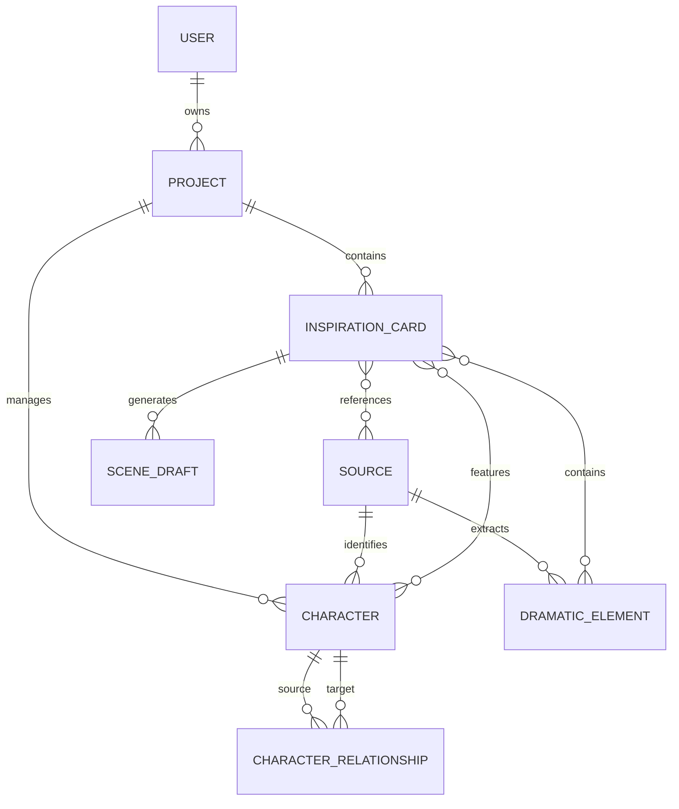

# Scriptly Data Model (Draft v1.2)

본 문서는 'Scriptly' 프로젝트의 핵심 데이터 구조와 관계를 정의합니다. 드라마 작가의 작업 흐름(자료 수집 -> 분석 -> 소재 확정 -> 초안 작성)을 데이터 모델로 형상화했습니다.

## 1. 개요 (High-level Overview)
- **Fact to Drama**: 외부의 사실(Source)을 드라마적 가치(DramaticElement)로 정제하고, 이를 프로젝트(Project) 내의 소재(InspirationCard)로 구축하여 최종적으로 대본 초안(SceneDraft)을 도출합니다.

## 2. 주요 엔티티 정의

### A. User (사용자)
시스템을 이용하는 작가 정보입니다.
- **Attributes**:
  - `id`: UUID
  - `email`: 이메일 (로그인 식별자)
  - `name`: 필명 또는 성명
  - `created_at`: 가입일

### B. Project (프로젝트)
작가가 집필 중인 하나의 작품 단위입니다.
- **Attributes**:
  - `id`: UUID
  - `owner_id`: ForeignKey (User)
  - `title`: 작품 제목 (가제)
  - `description`: 작품 전체 개요
  - `created_at`: 생성일
  - `updated_at`: 수정일

### C. Source (원천 자료)
시스템으로 유입되는 모든 기초 정보입니다.
- **Attributes**:
  - `id`: UUID
  - `type`: NEWS | FILE | NOTE
  - `title`: 제목
  - `summary`: AI가 생성한 핵심 요약
  - `content`: 원문 내용 (또는 텍스트 추출본)
  - `source_url`: (뉴스일 경우) 출처 URL
  - `tension_score`: 드라마적 긴장도 점수 (0~100)
  - `tension_reason`: 긴장도 점수 부여 근거 (AI 분석)
  - `published_at`: 원문 발행일
  - `ingested_at`: 시스템 수집일
  - `updated_at`: 수정일
  - `metadata`: JSON (파일 경로, 원본 매체명 등)

### D. DramaticElement (드라마적 요소)
`Source`로부터 AI가 추출한 핵심 서사 단위입니다.
- **Attributes**:
  - `id`: UUID
  - `source_id`: ForeignKey (Source)
  - `element_type`: CONFLICT(갈등) | DESIRE(욕망) | EVENT(사건)
  - `description`: 분석된 상세 내용
  - `dramatic_score`: 드라마적 가치 점수 (0~100)
  - `tags`: List[String]

### E. Character (인물)
자료 내 실제 인물 혹은 이를 바탕으로 변환된 드라마 캐릭터입니다.
- **Attributes**:
  - `id`: UUID
  - `project_id`: ForeignKey (Project)
  - `name`: 성명/가명
  - `role`: 역할 (자료 내 역할 또는 드라마적 포지션)
  - `internal_desire`: 내면적 욕망
  - `external_conflict`: 외부적 갈등 요인
  - `description`: 특징 및 배경 정보
  - `updated_at`: 수정일

### F. CharacterRelationship (인물 관계)
캐릭터 간의 대립, 협력 등 드라마적 관계를 정의합니다.
- **Attributes**:
  - `source_character_id`: ForeignKey (Character)
  - `target_character_id`: ForeignKey (Character)
  - `relation_type`: ENEMY | ALLY | LOVER | FAMILY
  - `description`: 관계의 상세 설명 (예: "과거의 비밀을 공유하는 사이")

### G. InspirationCard (소재 카드) - *핵심 단위*
작가가 최종적으로 '이것은 소재가 된다'고 판단하여 아카이빙한 결과물입니다.
- **Attributes**:
  - `id`: UUID
  - `project_id`: ForeignKey (Project)
  - `title`: 작가가 붙인 소재 제목
  - `status`: DRAFTING | COMPLETED | ARCHIVED
  - `genres`: List[String] (장르 태그 모음)
  - `logline`: 한 줄 요약
  - `full_synopsis`: 풀 시놉시스 본문
  - `user_note`: 작가의 개인 메모
  - `created_at`: 생성일
  - `updated_at`: 수정일
  - `linked_sources`: Many-to-Many (Source)
  - `linked_elements`: Many-to-Many (DramaticElement)
  - `linked_characters`: Many-to-Many (Character)

### H. SceneDraft (씬 초안)
소재 카드를 기반으로 생성된 구체적인 드라마 씬입니다.
- **Attributes**:
  - `id`: UUID
  - `card_id`: ForeignKey (InspirationCard)
  - `genre`: 해당 씬의 특정 장르/톤 (예: "느와르 스타일")
  - `scene_summary`: 씬 목적 및 요약
  - `content`: 씬 대본/지문 본문
  - `version`: 버전 관리 (v1, v2...)
  - `created_at`: 생성일
  - `updated_at`: 수정일

## 3. 엔티티 관계도 (Entity Relationship)

## 4. 데이터 흐름 (Data Flow)

1.  **Curation/Ingestion**: 뉴스를 크롤링하거나 PDF를 업로드하여 `Source` 생성 (이때 `summary`와 `tension_score` 자동 생성).
2.  **Insight Extraction**: `Source`를 LLM으로 분석하여 `DramaticElement`와 `Character` 추출 및 `Project`에 할당.
3.  **Synthesis**: 작가가 여러 요소를 조합하여 `InspirationCard`를 생성하고 `status`를 관리.
4.  **Drafting**: `InspirationCard`의 맥락과 선택한 장르를 바탕으로 LLM이 `SceneDraft`를 생성.
