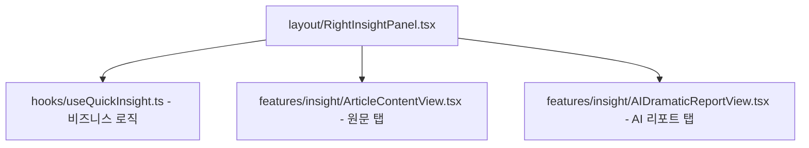

# Scriptly 프론트엔드 컴포넌트 고도화 및 리팩토링 세부 계획서 (v1.0)

본 문서는 프론트엔드(`scriptly-web`) 코드베이스 내에서 발견된 거대 컴포넌트(Monolithic Component)들의 복잡성을 완화하고, 단일 책임 원칙(SRP) 및 Container-Presentational 패턴을 적용하여 아키텍처 정밀도를 높이기 위한 구체적인 소스 리팩토링 실행 계획서입니다.

---

## 📊 1. 리팩토링 대상 거대 컴포넌트 현황

라인 수 분석 결과, 리팩토링이 가장 시급한 3대 컴포넌트는 다음과 같습니다.

1. **`src/app/page.tsx`** (1,845 라인): 메인 대시보드 엔트리
2. **`src/components/features/world/WorldBuildingView.tsx`** (1,077 라인): 세계관 설정실
3. **`src/components/layout/RightInsightPanel.tsx`** (694 라인): 퀵 인사이트 우측 패널

---

## 🛠️ 2. 컴포넌트별 세부 리팩토링 계획

### 📍 1단계: `RightInsightPanel.tsx` 슬라이싱 및 비즈니스 로직 격리

* **문제점**: 
  * 탭 상태 전환, 기사 크롤링 API 연동, 게이지바 및 인물/사건 리스트 마크업이 한 파일에 혼재되어 있어 복잡도가 높음.
* **리팩토링 방향**:
  * 비즈니스 로직과 API 상태 제어는 Custom Hook으로 위임하고, 원문 보기와 AI 분석 뷰를 서브 컴포넌트로 완전히 떼어냅니다.

* **액션 아이템**:
  1. **[NEW] `src/hooks/useQuickInsight.ts` 생성**:
     * 실시간 크롤링 상태(`isCrawling`, `crawledContent`), AI 분석 상태(`isSourceAnalyzing`), 저장 상태(`isSaving`) 및 분석 요청 함수(`handleTriggerQuickAnalysis`), 보관함 저장 함수(`handleSaveToArchive`)를 캡슐화합니다.
  2. **[NEW] `src/components/features/insight/ArticleContentView.tsx` 생성**:
     * 외부 기사 새창 이동 배너, Skeleton UI 로더, 본문 텍스트 렌더링(`whitespace-pre-wrap`) 등 **기사 원문 렌더링**을 전담하는 순수 컴포넌트입니다.
  3. **[NEW] `src/components/features/insight/AIDramaticReportView.tsx` 생성**:
     * Dramatic Tension 지수 게이지, 갈등 구조 인용구, AI 핵심 요약 및 해시태그, 인물 추출 리스트, 주요 사건 목록 마크업을 전담합니다.

---

### 📍 2단계: `WorldBuildingView.tsx` 도메인 컴포넌트 분할

* **문제점**:
  * 5대 세계관(무대, 세력, 규칙, Glossary) 전체 입력 폼과 테이블 뷰, 인라인 추가 동선이 한곳에 뭉쳐 있어 코드 변경 시 사이드 이펙트 발생 위험이 높음.
* **리팩토링 방향**:
  * 각 탭에 해당하는 서식과 트리 탐색기를 독립된 프레젠테셔널 컴포넌트로 도려냅니다.

* **액션 아이템**:
  1. **[NEW] `src/components/features/world/WorldStageExplorer.tsx` 생성**:
     * 좌측 사이드바 트리 구조(시공간 무대 계층형 목록 및 Plus 버튼 단축 추가 동선)만 전담 렌더링합니다.
  2. **[NEW] `src/components/features/world/forms/WorldStageForm.tsx` 생성**:
     * 시공간 무대의 세부 상세 편집 입력 폼을 분리합니다.
  3. **[NEW] `src/components/features/world/forms/WorldFactionForm.tsx` 생성**:
     * 세력/집단 상세 정보 및 연동 무대 선택 드롭다운 폼을 분리합니다.
  4. **[NEW] `src/components/features/world/forms/WorldRuleCultureForm.tsx` 생성**:
     * 사회 제도 및 문화 규칙 상세 편집 폼을 분리합니다.
  5. **[NEW] `src/components/features/world/forms/WorldGlossaryGrid.tsx` 생성**:
     * 카테고리 용어 사전 자유 인라인 편집 표(Table) 뷰와 정렬 로직을 담당합니다.
  6. **[MODIFY] `WorldBuildingView.tsx` 축소**:
     * 본체는 `useWorldSettings` 훅에서 필요한 데이터를 바인딩받고, 위의 분할된 컴포넌트들을 탭 인덱스에 따라 분기 렌더링해 주는 **조율기(Orchestrator)** 역할만 수행하도록 코드를 200라인 이하로 축소합니다.

---

### 📍 3단계: `src/app/page.tsx` 다이어트 및 전역 모달 프로バイ더(Provider) 체계 도입

* **문제점**:
  * 프로젝트 선택 상태, 워크스페이스 탭 전환, 5개 이상의 팝업 모달(프로젝트 생성, 아카이브 로드, 백업 복원 등)의 마크업과 상태가 엔트리 파일에 전부 선언되어 1800라인을 돌파함.
* **리팩토링 방향**:
  * 모달 렌더링을 선언형(Zustand 전역 상태 제어)으로 바꾸어 메인 트리에서 제거하고, 메인 레이아웃과 워크스페이스 분기를 격리합니다.

* **액션 아이템**:
  1. **[NEW] `src/store/useModalStore.ts` 생성**:
     * 열려 있는 모달의 종류(`"createProject" | "linkArchive" | "importBackup" | null`)와 매개변수를 전역 관리하는 스토어입니다.
  2. **[NEW] `src/components/shared/ModalProvider.tsx` 생성**:
     * `useModalStore`를 관찰하여 해당하는 모달 컴포넌트를 클라이언트 사이드에서 동적으로 마운트해 줍니다. 이로 인해 `page.tsx` 내의 수백 라인의 모달 선언 코드가 단 한 줄(`<ModalProvider />`)로 단축됩니다.
  3. **[NEW] `src/components/features/workspace/WorkspaceContainer.tsx` 생성**:
     * `page.tsx` 내에 있던 정보, 캐릭터, 플롯, 시놉시스, 대본, 세계관 탭 분기 로직을 전담하는 레이아웃 조율 컴포넌트입니다.
  4. **[MODIFY] `src/app/page.tsx` 축소**:
     * 최상위 레이아웃 구성 및 `ModalProvider` 선언, 사용자 인증 가드 상태 검증만 수행하도록 다이어트하여 가독성을 극대화합니다.

---

## 📅 3. 리팩토링 단계별 일정 및 안정성 확보 계획

* **1단계 (RightInsightPanel 개편)**: 리스크가 상대적으로 적은 우측 탭 컴포넌트부터 슬라이싱을 진행하여 Hook 기반 상태 관리가 안전하게 도는지를 검증합니다.
* **2단계 (WorldBuildingView 개편)**: 세계관 도메인의 복잡한 폼 로직을 개별 컴포넌트로 떼어내고, TypeScript의 엄격한 타입 가드를 통해 Props 전송 정합성을 확인합니다.
* **3단계 (page.tsx 최상위 리팩토링)**: 최종적으로 최상위 엔트리의 의존성을 걷어내고 전역 모달 아키텍처를 활성화합니다.
* **안정성 검증**: 각 리팩토링 단계 완료 시마다 `npx tsc --noEmit`을 구동하여 정적 타입이 완벽히 정렬되었는지 연속적으로 빌드 테스트를 수행합니다.
